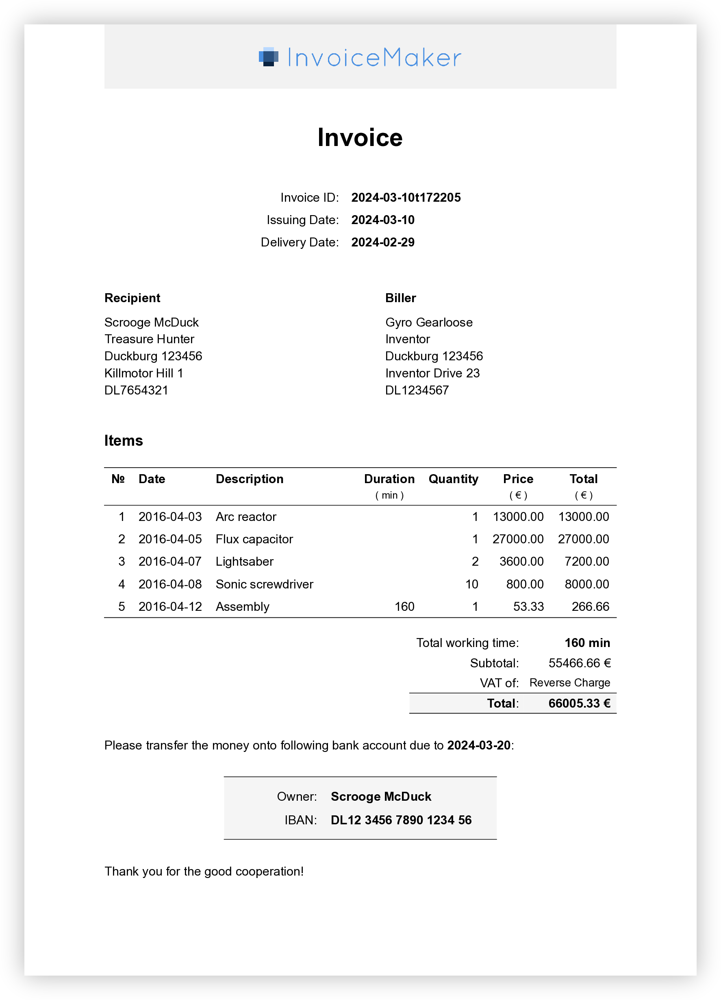

# Invoice Maker

Generate beautiful invoices from a simple data record.

<a href="./fixtures/expected-en.pdf">
  
</a>


## Features

- **Simple, yet Powerful**
    - Write invoices as simple `.typ` or `.yaml` files
    - No need to install anything but [Typst]
    - Support for cancellations, discounts, and taxes
- **Multilingual**
    - Integrated support for English and German
    - Easy to add more languages by adding a translation dictionary
        (Check out this example:
        [custom-language.typ](./examples/custom-language.typ))
- **Customizable**
    - User your own banner image
    - Customize the colors and fonts
- **Elegant**
    - Modern design with a focus on readability
    - PDFs with a professional look
- **Stable**
    - Visual regression tests to ensure consistent output
- **Free and Open Source**
    - ISC License

[Typst]: https://typst.app


## Installation & Usage

1. Download the [invoice-maker.typ](./invoice-maker.typ) file
1. Create a new `invoice.typ` file.
    E.g. based on one of the examples below:
    - [English example](./example-en.typ)
    - [German example](./example-de.typ)
    - [YAML example](./example-load-yaml.typ)
1. Run typst to generate the invoice:
    ```sh
    typst compile invoice.typ
    ```
1. Use the generated `invoice.pdf` file 🎉


## Development

Run Tests:

```sh
make test
```


## Legacy Version

Invoice Maker was originally implemented with TypeScript and Pandoc
as seen in [`./typescript_pandoc`](./typescript_pandoc).

This version is still in maintenance mode, but will not receive new features.
