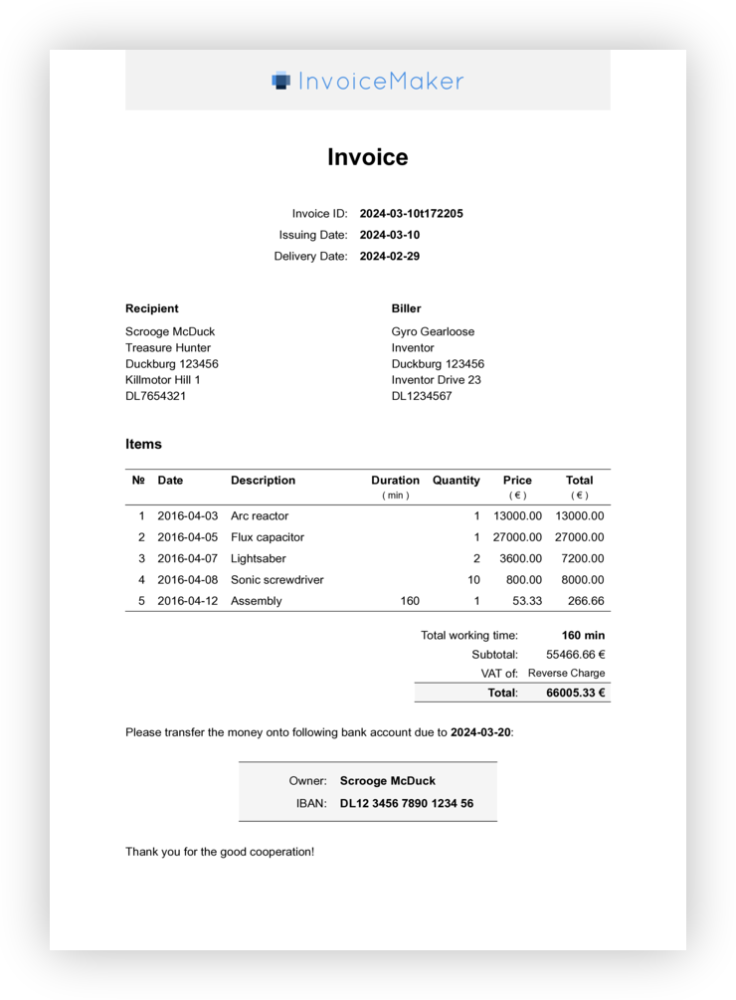

# Invoice Maker

Generate beautiful invoices from YAML files.

[](./tests/invoice.pdf)


## Installation

The easiest way to install invoice-maker is to pull its Docker image:

```sh
docker pull adius/invoice-maker
```


## Usage

Run the command without any arguments to print the usage information:

```txt
$ docker run --rm -v "$PWD":/workdir invoice-maker
Usage: invoice-maker \
        [--biller <*.yaml>] \
        [--recipient <*.yaml>] \
        [--output <*.pdf>] \
        [--logo <*.png>] \
        [--debug] \
        --data <*.yaml>
```

E.g. to generate the example invoice you can run:

```sh
docker run --rm -v "$PWD":/workdir adius/invoice-maker \
  --biller tests/biller.yaml \
  --recipient tests/recipient.yaml \
  --data tests/invoice.yaml \
  --logo images/wordmark.png \
  --output tests/invoice.pdf
```

Checkout the [tests](./tests) directory for more example files.


## Development

Run Tests:
```sh
yarn test
```

Create screenshot:
```sh
convert -density 200 \
  tests/invoice.pdf \
  -background white \
  -flatten \
  images/example-invoice.png
```
